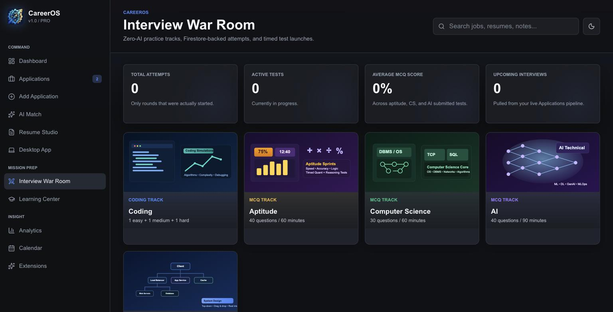
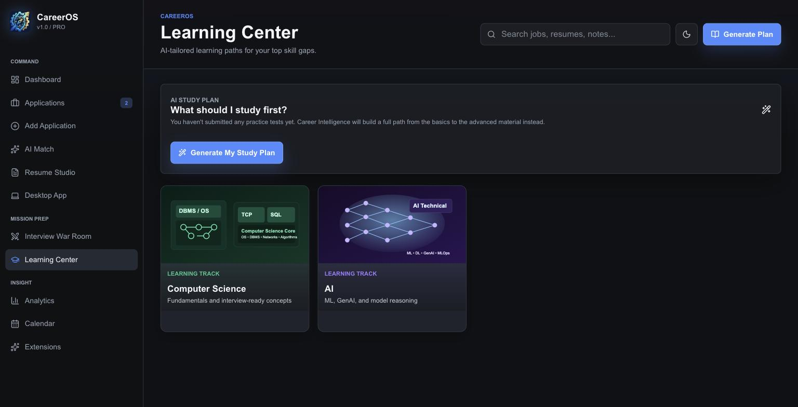

# CareerOS

**One workspace for the whole job search:** track applications, capture job posts from the browser, tailor resumes, and prepare for interviews with aptitude tests, system design practice and a local multi-language coding judge.

**Try it:** [projectyourown.com](https://www.projectyourown.com) · [Chrome extension](https://chromewebstore.google.com/detail/careeros-capture/llendblljmalpjakenfmllaajhblkcim) · [Desktop release](https://github.com/keshav-019/career-os/releases) · Android app coming soon

| Interview War Room | Learning Center |
| --- | --- |
|  |  |

CareerOS is a monorepo with five apps that share one Firebase backend and one set of domain types.

| App | Path | What it does |
| --- | --- | --- |
| **Web** | [`apps/web`](apps/web) | Next.js app: dashboard, application pipeline, AI job match, resume builder (visual + LaTeX), Interview War Room, System Design, Learning Center, analytics, calendar, 2FA, admin tools |
| **Desktop** | [`apps/desktop`](apps/desktop) | Electron companion: local LaTeX resume compilation and a coding-arena judge for C, C++, Java, JavaScript, Python and Rust using the toolchains already on your machine |
| **Browser extension** | [`apps/extension`](apps/extension) | [Published on the Chrome Web Store](https://chromewebstore.google.com/detail/careeros-capture/llendblljmalpjakenfmllaajhblkcim). Manifest V3 extension that detects job postings and saves them to CareerOS (Google/GitHub OAuth via `chrome.identity`) |
| **Mobile** | [`apps/mobile`](apps/mobile) | React Native / Expo Android app (not yet on the Play Store) with feature parity for everything that doesn't need local compilers |
| **Mobile backend** | [`apps/mobile-backend`](apps/mobile-backend) | Long-running Express server that reuses the web app's business logic directly (no copy-paste) for routes that need the Firebase Admin SDK |

Shared types and contracts live in [`packages/shared`](packages/shared).

## Tech stack

- **Frontend:** Next.js (App Router), React, TypeScript, CodeMirror, pdf.js
- **Backend:** Next.js route handlers, Express, Firebase Auth, Firestore, Firebase Admin SDK
- **Storage:** Cloudflare R2 (S3 API) and Cloudinary
- **Desktop / mobile:** Electron, React Native, Expo
- **Deploy:** Vercel (web), Docker on a self-hosted server (mobile backend, [`apps/mobile-backend`](apps/mobile-backend#deploying-docker-on-vanisherprojectyourowncom)); packaging configs for the Chrome Web Store, winget, Chocolatey and Flathub

## Architecture notes

- **One env file.** Every workspace loads the repo-root `.env.local`; [`.env.local.example`](.env.local.example) is the only tracked template.
- **Why a separate mobile backend?** On Vercel's serverless runtime, routes that use `firebase-admin` fail in production even though they work locally. Rather than duplicate code, `apps/mobile-backend` imports `apps/web/src/lib/**` through a path alias and runs as a normal Node process.
- **Local-only execution stays local.** Code execution and LaTeX compilation run on the user's machine through the desktop helper, which only listens on localhost.
- **Locked-down import API.** In production, `CAREEROS_ALLOWED_ORIGINS` and `CAREEROS_ALLOWED_EXTENSION_IDS` restrict who can call `/api/jobs/import`.

## Getting started

Requires Node 20 (see `.nvmrc`) and a Firebase project.

```bash
cp .env.local.example .env.local   # fill in Firebase, R2 and Cloudinary values
npm install
npm run dev                        # web app on http://localhost:3000
```

Other workspaces:

```bash
npm run desktop:dev                # Electron companion
npm run extension:package:chrome   # build the browser extension
npm run mobile:android             # Expo Android app
npm run mobile-backend:dev         # Express backend for mobile
npm run typecheck                  # typecheck every workspace
```

Content seeds: [`coding-problems.seed.json`](coding-problems.seed.json) holds the original coding-arena problems (import them through `/admin/coding-problems`), and [`system-design-problems.seed.json`](system-design-problems.seed.json) is a reference export of the System Design catalog.

## Contributing

Every folder has its own README describing what it owns and how it integrates. Keep changes scoped to one folder where possible. If a shared contract changes (types, payloads, route behaviour), update the dependent apps in the same PR, and run `npm run typecheck` before opening it.

Never commit Firebase keys or server secrets. Use `.env.local` locally and the hosting provider's environment variables in deployments.
